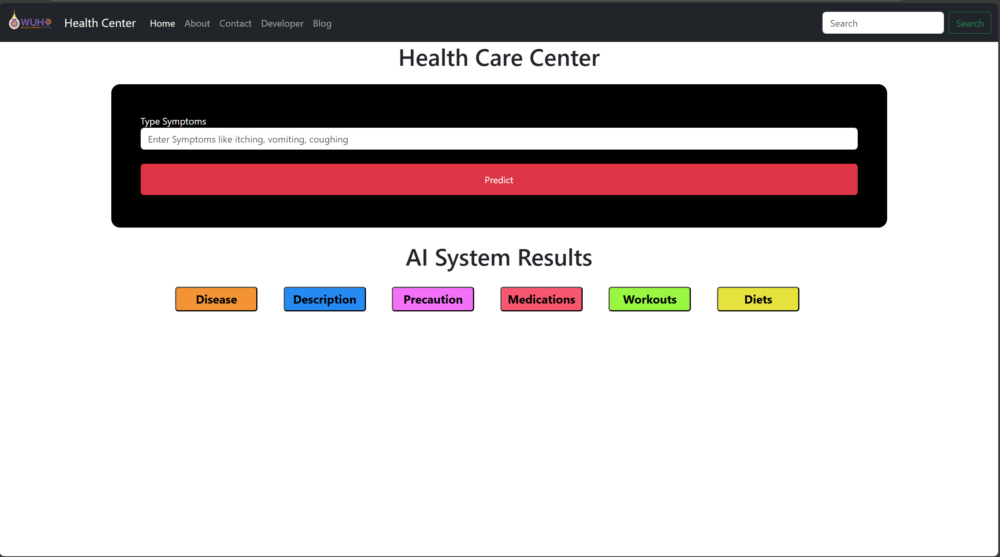

# Health Care Center - Medicine Recommendation System

A web application that suggests preliminary health information based on user-provided symptoms, built with Flask and a Scikit-learn machine learning model.



---

## 📋 Table of Contents
- [📖 About The Project](#about-the-project)
- [✨ Features](#features)
- [📂 Project Structure](#project-structure)
- [🛠️ Technologies Used](#technologies-used)
- [🚀 Getting Started](#getting-started)
  - [Prerequisites](#prerequisites)
  - [Installation](#installation)
- [⚠️ Disclaimer](#disclaimer)
- [✉️ Contact](#contact)

---

## About The Project

This project is a web application designed to provide preliminary health recommendations. Users can input their symptoms, and the system utilizes a machine learning model to predict a potential ailment. It then provides relevant information such as a description of the condition, necessary precautions, and suggestions for medication, workouts, and diet.

This application was developed primarily for educational purposes to practice the end-to-end process of building, training, and deploying a machine learning model within a web framework.

---

## Features

- **Symptom-based Prediction:** Analyzes user symptoms to predict potential health issues.
- **Comprehensive Information:** Provides details on diseases, precautions, medications, workouts, and diets.
- **User-Friendly Interface:** A clean and simple UI built with Bootstrap 5 for easy navigation.
- **Multiple Pages:** Includes Home, About, Contact, and Developer pages for a complete user experience.

---

## Project Structure

The project is organized into the following key files and directories:
```.
├── medicine_recommendation_system.ipynb  # Jupyter Notebook for model training and creation.
├── main.py                               # The main Flask application file that handles routing and logic.
├── models/                               # Directory for the saved machine learning model (e.g., model.pkl).
├── datasets/                             # Directory for the training dataset.
├── static/                               # Contains static assets like CSS, images, and JavaScript.
└── templates/                            # Contains all the HTML files for the frontend.
    ├── index.html                      # The main prediction page.
    ├── about.html                      # Describes the project.
    ├── contact.html                    # Contact and developer profile links.
    └── developer.html                  # Information about the developer.
```
## Technologies Used
- **Backend:** Python, Flask
- **Machine Learning:** Scikit-learn, Pandas, NumPy
- **Frontend:** HTML, CSS, JavaScript, Bootstrap 5
- **Model Development:** Jupyter Notebook

## Getting Started
To get a local copy up and running, follow these simple steps.

### Prerequisites
Make sure you have Python and pip installed on your system.

- Python 3.x
- pip

### Installation

1. **Clone the repository:**
   ```sh
   git clone https://github.com/AreedaTJN/Medicine-Recommendation-System.git
   
   ```
2. **Install the required packages:**
   ```sh
   pip install -r requirements.txt
   ```
3. **Run the Flask application:**
   ```sh
   python main.py
   ```

## Disclaimer

**This application is for educational purposes only.** The predictions are not a substitute for professional medical advice.

## Contact

Areeda Thingjana  
📧 Email: [areeda.th@gmail.com](mailto:areeda.th@gmail.com)  
💻 GitHub: [AreedaTJN](https://github.com/AreedaTJN)  
🔗 LinkedIn: [Areeda Thingjana](https://www.linkedin.com/in/areeda-thingjana-89a115337/)

